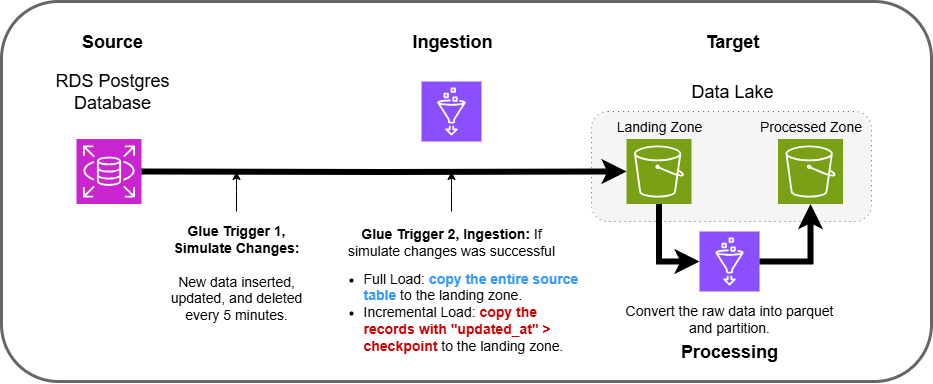
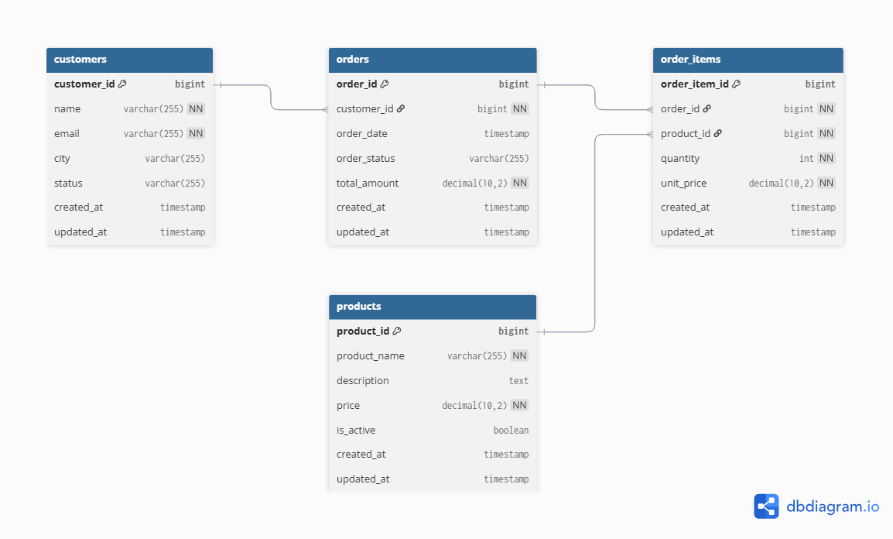

# AWS Ingestion

A series of mini-projects to build and analyze tradeoffs of different data ingestion techniques in AWS.

***Tags:** SQL, Python, AWS, Terraform, Ingestion, Batch, Full, Incremental, CDC, Streaming*

---

# Main Takeaways
I like to frame my main takeaways in a question & answer format, so that it makes it easier to review and test my knowledge later. Below are the things that I have learned from each project.

### 1: Batch Ingestion (Full vs Incremental)
> What are the main (quantifiable) tradeoffs to consider when picking a batch ingestion strategy?

answer

> When would I use a full load?

answer

> When would I use an incremental loading strategy?

answer

> What causes incremental pipelines to break?

answer

> What is the purpose of Change Data Capture (CDC)?

answer

---

# Results

### 1: Batch Ingestion (Full vs Incremental)
**Goal:** Build two ingestion pipelines using AWS Glue (batch and incremental) to ingest data from a local OLTP Postgres database into partitioned parquet files in S3. Measure how each pipeline handles three main dataset changes (inserts, updates, and deletes) with respect to cost, speed, and correctness. Understand the detailed tradeoffs between these two approaches for keeping a data lake in sync with a database.

- **Source:** Local OLTP Postgres database
- **Ingestion:** Glue
- **Transformation:** Glue
- **Target:** S3 (parquet, partitioned)

#### Analysis
There are three main factors that I kept in mind while performing the analysis.

- **Cost:** What is the cost model and how do costs look like they would scale for each pipeline given bigger and bigger datasets? And in general, so we can generalize cost outside of just AWS, how much data needs to be scanned with each approach?
- **Performance:** Runtime, memory usage, and scalability?
- **Correctness:** Does the data in S3 reflect the source?

**...(detailed analysis goes here)...**

#### Running the Code
**`...detailed code instructions go here...`**

--- 

# Methods

### Data
For the projects, I decided to create a single synthetic dataset with a simple data model, shown below. 

**... (add more explanation to how the data was generated and assumptions) ...**

**... (preview of the data here) ...**

Because many of the projects involve some sort of benchmarking, the data is also split into three sizes (small, medium, large).

**... (explanation of the sizes here) ...**

### Infrastructure as Code (IaC)
One side goal of mine when embarking on these projects was to get some extra practice using Terraform to write my AWS infrastructure as code. I see this skillset as becoming pivotally important for data engineers to master (even in single-cloud environments!) as the discipline continues to converge more and more with DevOps (not to mention its pretty satisfying to be able to spin everything up so conveniently).

The way I practiced this was as simple as (1) building out the project normally, via AWS console + CLI, and then (2) replicating my exact environment/results with Terraform.

### AI
There are two main use-cases for AI (I'm using "AI" here as a shorthand for things like large language models, agents, and so on) in the realm of software: learning and coding. I believe that it is better for my long-term development as an engineer, systems thinker, and problem solver to avoid (as much as possible) just using AI to generate all of the code. Not only have studies shown that [AI coding assistance can significantly decrease mastery at the benefit of slightly faster speed](https://www.anthropic.com/research/AI-assistance-coding-skills), but it also takes away a lot of the joy and craft of figuring things out for yourself.

That being said, I will still occasionally code generate on personal projects meant for learning. But usually only for boring / routine tasks I can do in my sleep. My main use of AI is still learning things quicker, for which I find it indispensable. [AI was also helpful to come up with some of the project ideas](https://chatgpt.com/share/69c590de-e868-8328-b018-b9dafb5f5912) I executed in this repository, as well as ideas on questions to ask myself, experiments to perform, overall structure, and so on.

### Diagrams
The architecture diagrams were created with draw.io and the data model diagrams were created with dbdiagram.io.

--- 

# Conclusion
This was really fun and I learned a lot.

**... (summary of my main takeaways section here) ...**

I highly recommend that if you are interested in getting a deep understanding of data ingestion on AWS, enough that you can comfortably build out quick pipelines and have deep discussions about pipeline architecture and design tradeoffs, that you do something similar.