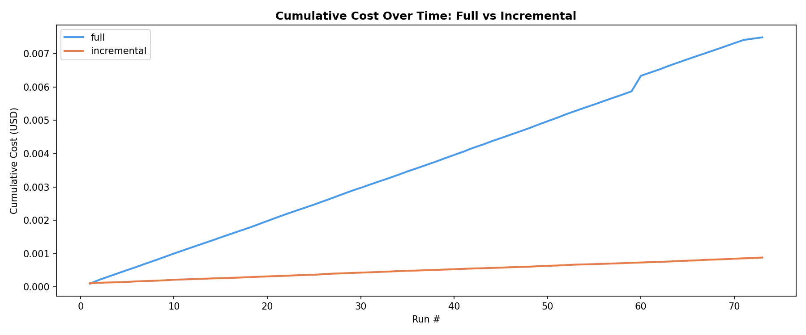
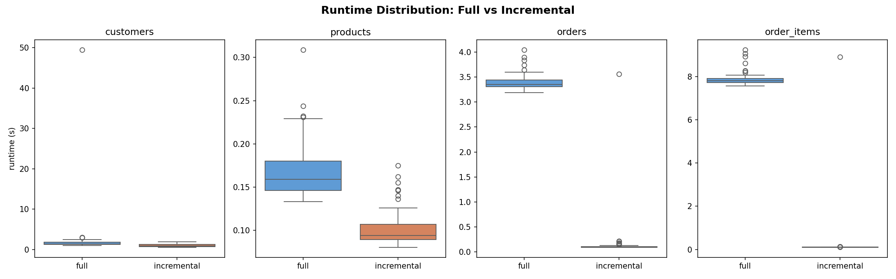
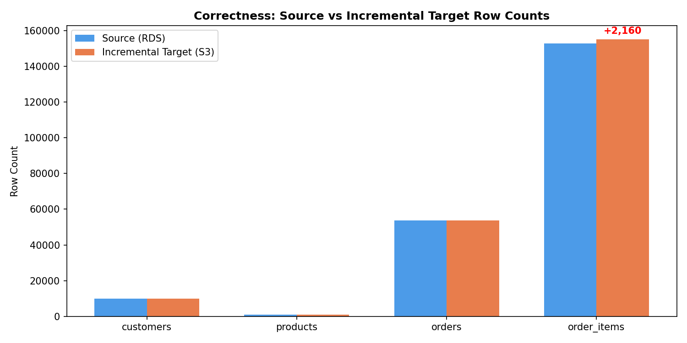

# AWS Ingestion

A series of mini-projects to build and analyze tradeoffs of different data ingestion techniques in AWS.

***Tags:** SQL, Python, AWS, Terraform, Ingestion, Batch, Full, Incremental, CDC, Streaming*

---

# Main Takeaways
I like to frame my main takeaways in a question & answer format, so that it makes it easier to review and test my knowledge later. Below are the things that I have learned from each project.

### 1: Batch Ingestion (Full vs Incremental)
> Q1. What are the main factors to consider when picking a batch ingestion strategy?

The purpose of a batch ingestion pipeline is to load data from your sources to your target. Before picking a strategy, it is helpful to answer questions arising from the [4V Framework](https://www.researchgate.net/publication/263123409_How_global_brands_create_firm_value_The_4V_model):
- **Variety:** What kind of data will be ingested (structured, unstructured, semi)?
- **Volume:** How much data needs to be moved?
- **Velocity:** How often does data need to move?
- **Veracity:** What are the requirements on quality/accuracy/completeness?

There are some other considerations as well (that unfortunately don't start with V!):
- **Load:** How much resources can your source systems spare? Are they normally under high load? 
- **Complexity:** How much infrastructure do you have and complexity you are able to deal with?
- **Cost:** What is the budget? (though I like to optimize for this factor last, since it will always be a goal to minimize cost).

> Q2. What causes incremental pipelines to break?

Hard deletes, schema changes, a missing/inconsistent "updated_at" field, late-arriving data, and checkpoint corruption/failure are all issues that cause incremental pipelines to break. 

Hard deletes is the only failure mode that I purposely explored in this project. Schema changes in the source system pose an issue because incremental pipelines can't detect them. Another problem is "updated_at" fields, which can be defined inconsistently (or not at all) across systems. Late arriving dimensions poses an issue too: since the updated_at field will be backdated it will be missed by future runs. 

Finally, corruption/failure with the checkpoint is another failure mode. I actually discovered this one accidentally. I was looking at my analysis charts after finishing the pipeline runs and noticed that the amount of rows in the target tables were not what I expected. Looking at the logs I realized that I started off with an incorrect checkpoint (from a test run that I forgot to delete). I then deleted the checkpoint, restarted the pipeline, and everything came out well.

> Q3. What about Change Data Capture (CDC)?

CDC provides real-time information on what changes occured in a database (new records, updates, hard deletes). This information can then be used to sync the target with the source. Importantly, CDC is robust to hard deletions (unlike incremental pipelines). Thus, CDC can possibly be useful for situations where the source db has hard deletes, yet full loads are unwanted (either due to cost, performance, or data freshness requirements).

CDC isn't a silver bullet, of course, and I'll discuss its failure modes in a future project (most likely using AWS DMS or Kafka + Debezium for implementation).

> Q4. When would I use a full load, an incremental load strategy, and a CDC strategy? Tradeoffs to consider?

Based on the factors from question 1, below is my general framework for picking a load strategy (assuming tabular data sources only).

I start with a bias towards the full loading strategy. Its the simplest and suited for most scenarios. Especially if the data **volume** is low. If volume is high, performance will start to suffer and you will incur heavy load on the source. This really can start to hurt you depending on your **velocity** requirements. If your load time is greater than the data freshness requirement, then that is an obvious no-go and you will have to abandon the full strategy. On the extreme-side of velocity, where you need fresh data on a real-time basis, your only real option is CDC. An incremental pipeline could work for batch or micro-batch. But incremental could also have a negative effect on your data's **veracity**. As shown in the analysis, incremental isn't very good at handling hard deletes from the source. But... if your data doesn't need to be *completely* correct that might be fine. Some data teams use a daily incremental pipeline to get new data quickly, and a full batch pipeline every sunday (when load is low) to correct the mistakes. Or a micro-batch incremental pipeline and daily full batch. Of course if you are doing that it may just make sense to go with a CDC pipeline where you can determine how often the data gets updated and worry less about performance and load. The flip-side of pursuing CDC is the extra complexity cost associated with building and maintaining it. Even with an experienced team, complexity adds up and its better to go with the simplest solution that fits the business requirements.

---

# Results

## 1: Batch Ingestion (Full vs Incremental)
**Goals:** Build two batch ingestion pipelines (full and incremental) to ingest data from an OLTP database to an S3 data lake every 5 minutes. Evaluate the cost, performance, and correctness of each pipeline. Understand the detailed tradeoffs between these two approaches for keeping a data lake in sync with a database.

- **Source:** RDS Postgres database.
    - Every 5 minutes: inserts, updates, soft deletes, and hard deletes.
    - Each table gets 100 changes in total.
        - Customers (100k records): 100 updates.
        - Products (10k records): 70 updates, 30 soft deletes.
        - Orders (50k records): 50 updates, 50 new records.
        - Order Items (150k records): 70 new records, 30 hard deletes.
- **Ingestion & Transformation:** Glue.
- **Target:** S3.
    &rarr; Landing Zone (raw, csv).
    &rarr; Processed Zone (partitioned, parquet).


**Seeding:** The source tables were seeded with a python script that creates a connection to the RDS database, creates the tables if they do not exist already, truncates them, and then copies synthetically generated data into them. 

**Orchestration:** Two glue triggers were created. One to run the script for simulating changes on the RDS database every 5 minutes. And if that script succeeds, the other trigger runs both ingestion pipelines.

**Querying:** I used DuckDB as a sort of swiss-army-knife of querying. Quick sanity checks, ad-hoc exploration, and building out the analysis script.

**Data Lake Structure:**

```
1-batch-ingestion-full-vs-incremental/
├── glue
│   └── scripts
│       ├── full_load.py
│       ├── incremental_load.py
│       ├── metrics.py
│       └── simulate_changes.py
├── incremental_checkpoint.json
├── metrics
│   └── metrics.csv
├── processing
│   ├── full
│   │   ├── customers
│   │   │   └── data.parquet
│   │   ├── order_items
│   │   │   └── data.parquet
│   │   ├── orders
│   │   │   └── data.parquet
│   │   └── products
│   │       └── data.parquet
│   └── incremental
│       ├── customers/ (73 items)
│       ├── order_items/ (73 items)
│       ├── orders/ (73 items)
│       └── products/ (73 items)
└── raw
    ├── full
    │   ├── customers.csv
    │   ├── order_items.csv
    │   ├── orders.csv
    │   └── products.csv
    └── incremental
        ├── customers/ (73 items)
        ├── order_items/ (73 items)
        ├── orders/ (73 items)
        └── products/ (73 items)
```

### Analysis
In all, each pipeline was run 73 times. There are three main factors that I kept in mind while performing the analysis.

- **Cost:** What is the cost model and how do costs look like they would scale for each pipeline given bigger and bigger datasets?
- **Performance:** Runtime, memory usage, and scalability?
- **Correctness:** Does the data in S3 reflect the source?

#### Cost
To estimate the cost of each run, I calculated
`cost_usd = (runtime_seconds / 3600) * GLUE_DPU * GLUE_DPU_PRICE_PER_HOUR` (where `GLUE_DPU = 0.0625` (because I configured my Glue jobs to use only 1/16th of a DPU) and `GLUE_DPU_PRICE_PER_HOUR = 0.44`). 

<p align="center">  
    
    Figure 1. Cumulative Cost Over Time: Full vs Incremental
</p>

**Figure 1** shows the cumulative cost over time for each pipeline. As you can see, there is quite a big gap between the two. This gap is better understood upon inspection of **Table 1**, where it becomes clear that the full pipeline costs an order of magnitude more. If you were to run these pipelines hourly for a whole month, you should expect to spend about **\$0.074** and **$0.009** on full and incremental, respectively.

<div align="center">

| job_type    |   total_runs |   total_cost_usd |   avg_cost_per_run_usd |   projected_daily_usd |   projected_monthly_usd |
|:------------|-------------:|-----------------:|-----------------------:|----------------------:|------------------------:|
| full        |           73 |         0.007491 |               0.000103 |                0.0025 |                  0.0739 |
| incremental |           73 |         0.000881 |               1.2e-05  |                0.0003 |                  0.0087 |

Table 1. Cost Data: Full vs Incremental
</div>

#### Performance

When analyzing pipeline performance, its important to look at percentiles. For example if you are looking at runtimes, the average just isn't nearly as informative as knowing the p50, p95, and p99. Thus, a good way of visualizing runtime is by plotting the distribution, as shown in **Figure 2**.
<p align="center">  
    
    Figure 2. Runtime Distribution: Full vs Incremental
</p>

The biggest difference between ingestion pipelines is when it came to the `orders` and `order_items` tables. This is unsurprising, since they have 50k and 150k records to start, respectively. As shown in **Table 2**, the median runtime for `order_items` full and incremental is 7.809 seconds and 0.102 seconds, respectively. Median memory usage for that same set was even starker: 73.575 mb versus 0.190 mb. When looking at performance data for tables that are much smaller, like customers and products, the distributions are much closer together.

<div align="center">

| job_type    | table       |   median_runtime_s |   min_runtime_s |   max_runtime_s |   median_memory_mb |
|:------------|:------------|-------------------:|----------------:|----------------:|-------------------:|
| full        | customers   |              1.378 |           1.034 |          49.508 |             16.033 |
| incremental | customers   |              0.885 |           0.5   |           1.913 |              8.812 |
| full        | order_items |              7.809 |           7.564 |           9.24  |             73.575 |
| incremental | order_items |              0.102 |           0.092 |           8.912 |              0.19  |
| full        | orders      |              3.353 |           3.183 |           4.045 |             31.881 |
| incremental | orders      |              0.099 |           0.09  |           3.555 |              0.221 |
| full        | products    |              0.159 |           0.133 |           0.309 |              0.908 |
| incremental | products    |              0.094 |           0.08  |           0.175 |              0.228 |

Table 2. Performance Data: Full vs Incremental
</div>

#### Correctness

To evaluate correctness, the drift was quantified. In tables that had only inserts or updates (`customers`, `products`, `orders`), no drift was measured (**Figure 3**). The only table with drift was `order_items`, which had hard deletes.

<p align="center">  
    
    Figure 3. Correctness: Source vs Incremental Target Row Counts
</p>

This is also shown in **Table 3**, where the `order_items` drift is 2160 records. This exposes one of the main weaknesses of incremental pipelines: handling hard deletions.

<div align="center">

| table       |    src |    tgt |   drift |
|:------------|-------:|-------:|--------:|
| customers   |  10000 |  10000 |       0 |
| products    |   1000 |   1000 |       0 |
| orders      |  53650 |  53650 |       0 |
| order_items | 152920 | 155080 |    2160 |

Table 3. Correctness Data: Full vs Incremental
</div>

### Running the Code
This is my setup (not currently designed for others to be able to run it, yet) to actually run this project.

1. Spin up AWS resources
```
cd ./terraform
terraform apply
cd ..
```
2. Create tables
```
psql <connection to rds db> -f ./data/create_tables.sql
```
3. Seed tables
```
uv run ./data/seed_tables.py --env rds --size large
```
4. Monitor results from Glue
--- 

# Methods

## Data
For the projects, I decided to create a single synthetic dataset with a simple data model, shown below. 

**... (add more explanation to how the data was generated and assumptions) ...**
<p align="center">  
    
</p>

**... (preview of the data here) ...**

Because many of the projects involve some sort of benchmarking, the data is also split into three sizes (small, medium, large).

**... (explanation of the sizes here) ...**

## Infrastructure as Code (IaC)
One side goal of mine when embarking on these projects was to get some extra practice using Terraform to write my AWS infrastructure as code. I see this skillset as becoming pivotally important for data engineers to master (even in single-cloud environments!) as the DE discipline continues to converge more and more with DevOps (not to mention its pretty satisfying to be able to spin everything up so conveniently).

The way I practiced this was as simple as (1) building out the project normally, via AWS console + CLI, and then (2) replicating my exact environment/results with Terraform. For simulating a real production environment, I placed my terraform backend in the root bucket for this repo, `sh26-aws-ingestion-tf`.

## AI
There are two main use-cases for AI (I'm using "AI" here as a shorthand for things like large language models, agents, and so on) in the realm of software: learning and coding. I believe that it is better for my long-term development as an engineer, systems thinker, and problem solver to avoid (as much as possible) just using AI to generate all of the code. Not only have studies shown that [AI coding assistance can significantly decrease mastery at the benefit of slightly faster speed](https://www.anthropic.com/research/AI-assistance-coding-skills), but it also takes away a lot of the joy and craft of figuring things out for yourself.

That being said, I will still occasionally code generate on personal projects meant for learning. But usually only for boring / routine tasks I can do in my sleep. Or for things such as plotting with matplotlib, which I do not need to learn the intricacies of and am happy delegating to AI. My main use of AI is still learning things quicker, for which I find it indispensable. [AI was also helpful to come up with some of the project ideas](https://chatgpt.com/share/69c590de-e868-8328-b018-b9dafb5f5912) I executed in this repository, as well as ideas on questions to ask myself, experiments to perform, overall structure, and so on.

## Diagrams
The architecture diagrams were created with draw.io and the data model diagrams were created with dbdiagram.io.

--- 

# Conclusion
This was really fun and I learned a lot.

**... (summary of my main takeaways section here) ...**

I highly recommend that if you are interested in getting a deep understanding of data ingestion on AWS, enough that you can comfortably build out quick pipelines and have deep discussions about pipeline architecture and design tradeoffs, that you do something similar.